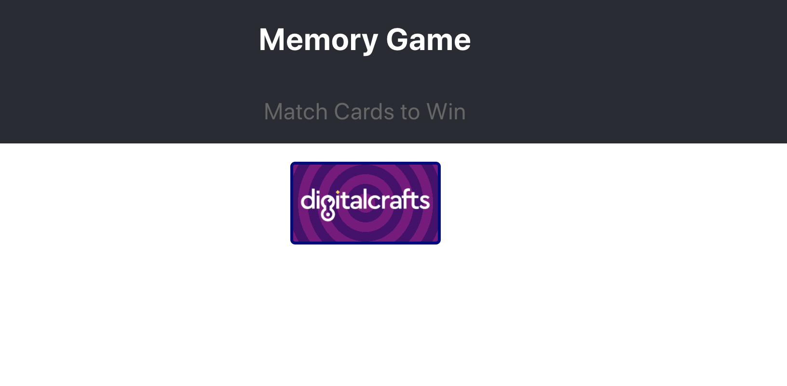

# Memory Game - Part 1: Setting up the visual Components

## Your task for Part 1

For now let’s try to create a ReactJS project that displays the initial state of the game: The game header with 16 cards face down on the board.

When you are finished, you should have a game _visually_ set up, but it won’t be interactive yet (clicking on the cards does nothing).

At the end of this section, you'll have something that looks like this:


### Step 1 - Starting a new project

Scaffolding a functioning ReactJS app can be a complicated process. Fortunately for us, there’s a npm package called `create-react-app` that handles this for us! It provides a fresh ReactJS project with all the fancy bells and whistles like hot-reloading and Jest testing. Run the following command from the terminal:

```bash
npx create-react-app memory-game
```

This will create a new folder named `memory-game` and populate it with boilerplate ReactJS code.

Change into that new directory and we can get started...

```bash
cd memory-game
```

Create a new branch called `part-1` and then run the application.

```bash
npm start
```

(We’ll create a new branch for part 2 and part 3 going forward.)

Congratulations! Your project should look something like this:


### Step 2 - Remove the boilerplate code

Let’s make the app header more specific to our project.

* In `App.js`, delete the JSX React logo. While you’re at it, remove the `import` statement at the top that’s bringing in the `logo.svg`
* Change the App title to “Memory Game”
* Add a subtitle that says “Match cards to win”
* Remove the any `<p>` tags
* Notice that `App.css` is imported at the top of `App.js`! This is your css styling for the App component. Let’s make some changes:
    1. Make the `App-header` class have a `height: 80px;`
    2. Make your new subtitle a bit smaller than the title
    3. Make the subtitle have the color `#666666`

Your project should look like this:


### Step 3 - Create a MemoryCard component

Our app is going to make use of 16 cards. Each card will render identically, and they’ll all behave in the same way (in that they’re going to be flipping over). This kind of repetition combined with the non-trivial behavior is a sign that the cards should probably be a React Component.

To make your project code organized, a good rule-of-thumb is to have each Component defined in its own `.js` or `.jsx` file.

1. Create a folder called `components` in the `/src` folder.
2. Create a `MemoryCard.jsx` file in the `/src/components` folder
3. Define a React Component class and export it
    1. Name the class `MemoryCard`
    2. Make sure to include `React` and `{ Component }` at the top
    3. Make sure you include the `export default` statement at the bottom
4. For now, let’s make the card render as a single `<h1>` tag that says “CARD”

Your app should look no different after this step! You’ve defined a new Component, but you’re not using it anywhere in your application. Let’s do that!

### Step 4 - Show a single MemoryCard to the screen

To show a MemoryCard, it needs to be rendered in your top level App component. We can do that using JSX.

* Import your memory card at the top of App.js

```jsx
import MemoryCard from ‘./components/MemoryCard';
```

* Add a self-closing `<MemoryCard />` tag below the `<header>` tag

That’s all it takes! Your app should now look like this:


### Step 5 - Make our card actually look like a card

* Create a `MemoryCard.css` file in the `/src/components` folder
* Import `MemoryCard.css` in MemoryCard.js <br/>(_look at how they did it in `App.js`_)
* Delete the `<h1>` tag we created in Step 3
* Replace it with a `<div>` tag with a class named “MemoryCard”
* In `MemoryCard.css`, define the css for the `.MemoryCard` class

```css
.MemoryCard {
    display: inline-block;
    width: 150px;
    height: 80px;
    margin: 3px;
    border-radius: 5px;
    border: solid 3px navy;
    cursor: pointer;
}
```

* Also give it a striped background, using an example from [Stripes in CSS](https://css-tricks.com/stripes-css/)
* Inside the `<div>` tag, add an `` tag that will hold the [DigitalCrafts logo](https://www.digitalcrafts.com/img/digitalcrafts-logo-white-y.png)
* Target the image tag in your CSS, give it these styles:

```css
 width: 100%;
 padding-top: 13px;
```

Your card should now look something like this:



### Step 6 - Render 16 cards to the screen

Now that our card is styled, we should show the whole deck to the screen

* Back in App.js, render 15 more cards
* To get them to line up in a 4 by 4 grid, group the Card tags using `<div>` tags

And we’re done! Our app should look like this now:


