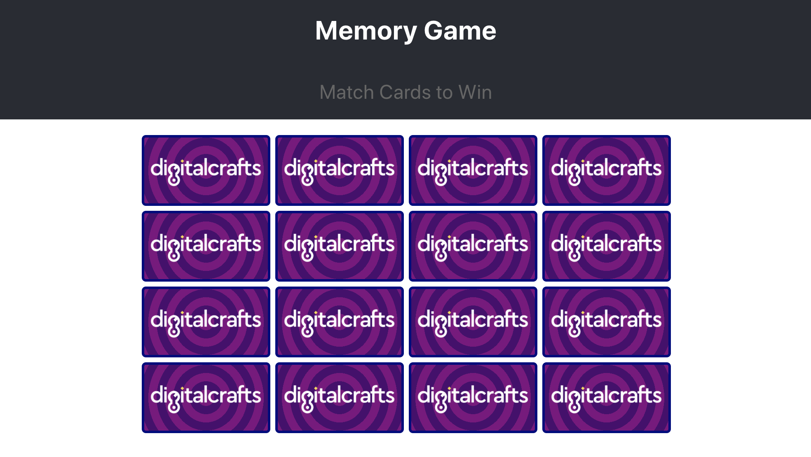
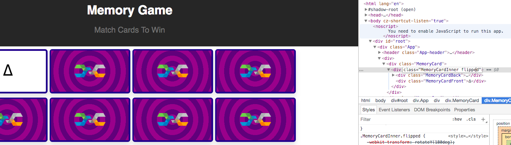
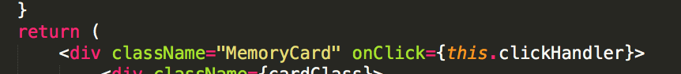
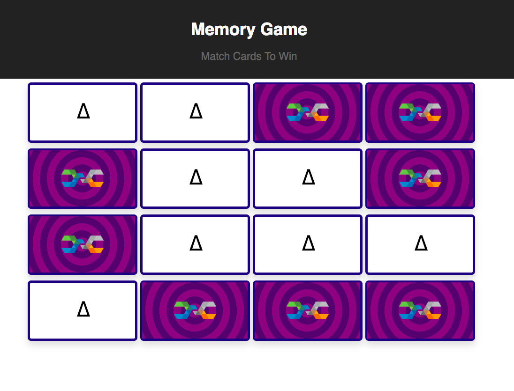

<!-- markdownlint-disable no-inline-html -->
# Memory Game - Part 2: Setting up click events

## Your task for part 2

If you finished part 1, you should have an app that renders something like this:



When you finish part two, these cards will flip over when clicked, revealing a symbol on the reverse side.

### Step 1 - CSS3 Card Flipping

Our cards look pretty neat, but they’re only one sided. We need to make them have a reverse side that gets revealed with CSS3 animations. To do this, we’re going to implement the card flipping implemented here:

[CSS Card Flip](https://codepen.io/torchcodelab/pen/VwmyNVO)

`NOTE`: _This example uses Stylus, a CSS pre-processor, so it won’t work if you just copy/paste!_

There’s a lot of CSS to write, so I encourage you to _save often_ and observe the effect of each style you write!

What we’ve implemented so far is the _back_ of the memory card, so let’s change the CSS class name to `.MemoryCardBack` instead of `.MemoryCard`

_Update all references to `.MemoryCard` in `MemoryCard.js` and `MemoryCard.css`_

* In `MemoryCard.js`, wrap the `MemoryCardBack <div>` with _another_ `<div>` with a class `MemoryCard`
* Inside of this _new_  `MemoryCard` and _after_ the `MemoryCardBack`, insert a new `<div>` with class `MemoryCardFront`
* Inside of the _new_ `MemoryCardFront`, insert the character `∆` inside of it (on Mac, `∆` can be typed by pressing `option+j`, on Windows hold down `alt` and type “30”)
* Wrap `MemoryCardFront` and `MemoryCardBack` with a `<div>` with a class of `MemoryCardInner`
* In `MemoryCard.css`, create new CSS blocks for `.MemoryCard`, `.MemoryCardInner`, and `.MemoryCardFront`

Let’s fix up our CSS for `.MemoryCard`

```css
.MemoryCard {
    display: inline-block;
    width: 150px;
    height: 80px;
    margin: 5px;
    cursor: pointer;
    position: relative;
    perspective: 800px;
}
```

Now let’s move on to `.MemoryCardInner`

```css
.MemoryCardInner {
    width: 100%;
    height: 100%;
    position: absolute;
    transform-style: preserve-3d;
    transition: transform 0.8s cubic-bezier(0.175, 0.885, 0.32, 1.275);
    border-radius: 5px;
    border: 3px solid navy;
    box-shadow: 0 6px 16px rgba(0,0,0,0.15);
}
```

Add a new css block that targets BOTH `.MemoryCardFront` _and_ `.MemoryCardBack`

```css
.MemoryCardBack,
.MemoryCardFront {
    position: absolute;
    width: 100%;
    height: 100%;
    backface-visibility: hidden;
}
```

Remove all the styling that is currently written for `MemoryCardBack` _except_ for the striped background style

Let’s write some styles specific to `.MemoryCardFront`

```css
.MemoryCardFront {
    font-size: 30px;
    line-height: 20px;
    transform: rotateY(180deg);
}
```

Finally, create a CSS block that targets `.MemoryCardInner` tags that _also_ have the class `.flipped`

```css
.MemoryCardInner.flipped {
    transform: rotateY(180deg);
}
```

Whew, that was a lot! If everything was written correctly, your app should render the same way as before (16 face down cards in a 4x4) grid. The CSS we just wrote makes the front of the cards hidden.

CSS3 is going to handle the flipping animation for us. We can see the flipping in action using the Chrome inspector! Right click one of the cards and select `inspect element`.

In the HTML viewer, double click on the `MemoryCardInner` class and add the class “flipped”:



You should see the card flip over to show the triangle symbol.

### Step 2 - Setting up the click handler

Let’s close `MemoryCard.css` and come back to `MemoryCard.js`.

We’re going to make these cards clickable using the `onClick` attribute. `onClick` is going to trigger a function that we’ll write in our MemoryCard class, so our task is twofold:

* Add a new function in your `MemoryCard` class called `clickHandler()`
* Make the `clickHandler` function call `alert(“card clicked”);` for now.

Easy-peasy, right? Now, let’s look at the JSX in the render function.

* Find the `<div>` tag that has `className=”MemoryCard”`
* In this tag, add another attribute called `onClick`
* Set the `onClick` attribute equal to `this.clickHandler`
  * Hint: Since you’re using basic Javascript inside of JSX, you need to use curly braces to wrap your javascript

Now your cards should be alerting whenever you click them! Let’s move on…

### Step 3 - Giving your component a brain

Right now, your MemoryCard component is pretty dumb. It only knows how to be rendered to the screen, and that’s it. But now we’re in a position where the card has two ways it can be rendered: either face down (no `.flipped` class on the `MemoryCardInner`), or face up (`.flipped` class added to `MemoryCardInner`).

Not only that, but it has to remember whether it’s currently flipped over or not, so that it can flip to the correct side when clicked.

Basically, our card needs to remember whether it’s flipped or not. We can add this kind of memory with something called `state.` The `state` should be initialized when the component is first created, i.e. in the constructor.

* Add a new function in your MemoryCard class called `constructor()`
* The first line in the constructor should be `super();`
    1. FYI - Our memory card class __extends__ the `React.Component` class i.e. Our memory card has all the behaviors of a React Component. `super()` is used to call the constructor of whatever class you’re extending. If we don’t call `super()`, our class won’t know how to correctly behave like a React Component.
* The next line should initialize the state of our card:

```jsx
this.state = { isFlipped: false };
```

This makes it so that a brand new `MemoryCard` will know that it’s not flipped over right off the bat.

Let’s look at the `clickHandler()` function we wrote earlier:

* Instead of calling `alert(‘card flipped’);`, we need to just update the `isFlipped` key in our `state` object
* Changing properties in a Component’s `state` can be accomplished by calling `this.setState();`
* `setState()` accepts one parameter: an object with all the key/value pairs you want to change
* That means we need to pass in an object like `{ isFlipped: ??? }`<br/> __NOTE__: We’ll figure out what the ???s should be in a second

Remember how boolean toggling works? It’s as simple as `booleanValue = !booleanValue`

* The boolean we’re toggling lives in `this.state.isFlipped` <br/>Therefore, the "???" you see above should be `!this.state.isFlipped`

All of the information ☝️ should be enough to complete the `clickHandler()` function.

It’s just a call to `this.setState()`, passing in the object above

_NOTE_: The React Dev Tools are *really helpful* for this part!

Now our MemoryCard component is smart! Every time we click the card, it’s updating its internal state back and forth between `{ isFlipped: true }` and `{ isFlipped: false }`

But visually, we don’t actually see the cards flipping over! We’ll fix this inside the `render()` method.

## Step 4 - Rendering MemoryCard based on the current state

Remember - the way we animate the flipping is by adding a “flipped” class to `MemoryCardInner`. But right now, the `className` of that div is hard-coded to `MemoryCardInner`. We need to be able to toggle it to `MemoryCardInner flipped`

* Inside the render function, __before the return statement__, create a variable called `memoryCardInnerClass`. Set it equal to the string “MemoryCardInner”.
* `this.state.isFlipped` will tell us whether or not this card should be flipped over.
* Create an if-block that checks `this.state.isFlipped` as the condition
* If `isFlipped` is true, append the string “flipped” to the `memoryCardInnerClass` variable
  * `Hint`: Ternary operators are really helpful here!
* Notice that we created the `memoryCardInnerClass` variable outside of the `return` statement beneath it.
  * _That means when can use this variable in our JSX!_
* Replace `className=”MemoryCardInner”` with `className={memoryCardInnerClass}`

That’s all it takes! React is constantly listening to every Components’ `this.state`

If the state ever changes, React will automatically call `render()` for you.

What happens when you click on a card?

## Step 5 - ERROR: Cannot read property `setState` of undefined

Oops, looks like our card component isn’t as smart as we thought. You’ll see an error like this when you click on a card.


Let’s break this error down.

The sentence “Cannot read property `setState` of undefined” implies that Javascript thinks that `this` is undefined.

It seems that our MemoryCard has forgotten who it is! Even though we wrote `clickHandler()` inside of the MemoryCard class, javascript thinks that it’s not attached to any class in particular.

The issue can be tracked down to our JSX:



To recap, we set an `onClick` property on the outer `<div>`, and we pointed it to this class’s `clickHandler` function.

Here’s one unfortunate thing about `onClick`: any function we call from `onClick` will lose its binding, i.e. its `this` value.

Fortunately we can fix that with a call to `.bind()`

In the line above, change `this.clickHandler` to `this.clickHandler.bind(this)`

This is just a gentle reminder to Javascript to pass down the correct `this` binding

---

__NOTE FROM SEAN__:

This section (**Step 5**) could be handled a few different ways. Arrow functions prevent the need to use the .`bind()` method.

For more on how to bind “this” see this article: [React Binding Patterns: 5 Approaches for Handling `this`](https://www.freecodecamp.org/news/react-binding-patterns-5-approaches-for-handling-this-92c651b5af56/)

---

Ok, NOW that’s it! The card flipping should be working beautifully!


