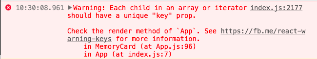

<!-- markdownlint-disable no-inline-html -->
# Memory Game - Part 3: Setting up click events

## Your task for part 3

If you finished part 2, you should have an app that renders something like this:


Clicking each card should toggle its flip animation. Now we’re at the point where the _visual_ mechanics of our application are in place, but now we need to top it off by implementing the _logic_ of the game.

Changes in our game state are going to control the flipping animation, which means we need to edit some of our existing code.

### Step 1 - Setting up the initial application state

As it stands, our application doesn’t implement the logic of “memory game”.

For small games like this, it’s typical to hold all of the game logic and state in the top level component - in our case, the `App` component.

Once once we set up the game logic in `App.js`, the App component can dictate how its MemoryCard children will render by using `props`.

To get started:

* Write a basic constructor for your App in `App.js`
  * Use `MemoryCard.js` as a reference
  * Don’t forget the call to `super()`
* Initialize the app state with 2 properties:
  * `deck`
  * `pickedCards`
* For now, set `deck` and `pickedCards` to empty arrays.

Again, use `MemoryCard.js` as a reference.

At this point, our App state is almost set up. The only thing that’s missing is filling up the `deck` array with the initial set of 16 “cards” (I put cards in quotes here, because in reality the cards are just basic Javascript objects). We’ll write a helper function that can generate a deck of memory cards for us.

* Define a function named `generateDeck` between the import statements and the class definition (Somewhere around line 5);
* The first line of the function should define a constant called `symbols`
  * Set `symbols` equal to an array containing these characters:<br/> `∆`,`ß`,`£`,`§`,`•`, `$`, `+`, `ø`
* Next, create an empty array named `deck`.<br/>We’ll be changing the data in this later in the next step.

We want to push 16 “card objects” into the `deck` array.

* We can write a `for-loop` that will loop 16 times.
  * `HINT`: Think `(let i = 0; i < 16; i++)`
* In the `for` loop, let’s push an object into the `deck`.
* You can do this directly as a new object into the `push` method, or you can create a new object first, and then `push` it into the `deck` array.
* The object we push should represent a card
* The object should have two properties (key/value pairs):
  * `isFlipped`
  * `symbol`
* Set `isFlipped: false`
* Set `symbol: symbols[i % 8]` <br/>(read this as: `'i' modulus '8'`)

Create a function called `shuffle`

* Put this after the `generateDeck()` function <br/>(outside the closing curly for `generateDeck`)
  * You can copy/paste the solution from this link (either version listed there will work): [https://stackoverflow.com/a/6274381](https://stackoverflow.com/a/6274381)
  * OR, you can figure out your own function for accepting an array and returning the same array, but shuffled.
* Back in `generateDeck` make a call to `shuffle(deck)`
* Finally, just return `deck`

We’ve just written a function that returns an array of cards! It has nothing to do with React, it’s _just a basic JS function_.

Now it’s time to use it in our App constructor:

* In the constructor where you set `this.state = …`, make the `deck` property point to a call to `generateDeck()`
* That’s it!

Alright, our App has a brain now! It can keep track of which cards are in the deck, as well as which cards the user is selecting as they play the game.

### Step 2 - Mapping state to Components

We’ve created a basic representation of the game using plain javascript, and we dumped it into App’s `state`. Unfortunately, it’s not useful to us unless we can show the state to the screen.

Yes, our App is currently displaying 16 MemoryCards to the screen, but those cards have nothing to do with the game `state`.

Let’s change that!

_Before_ the `return` statement of the `render()` function, create a variable called `cardsJSX`

* We’re going to hold an array of `<MemoryCard />` elements in this array
* Set `cardsJSX` equal to `this.state.deck.map();`
* Inside the call to `map()`, write an anonymous function that takes `card` and `index` as parameters
* Make sure to use the ES6 syntax for anonymous functions, the “arrow” operator
  * `(param1, param2) => { ... }`
* Make this anonymous function return `<MemoryCard />`

At this point, `cardsJSX` should be an array that holds 16 `<MemoryCard />` components.

We will use the `slice()` method to render each group of 4 `MemoryCards` inside of App’s JSX.

* `HINT`: Using `slice()` looks like: `slice(startIndex, endIndex)`

Inside the return statement of the render function, you probably have 16 `<MemoryCard />` tags

Replace those tags with the following:

* `{cardsJSX.slice(0,4)}`
* `{cardsJSX.slice(4,8)}`
* `{cardsJSX.slice(8,12)}`
* `{cardsJSX.slice(12,16)}`

Ok great! Visually, nothing should change about your application, but now we have this one-to-one mapping of `MemoryCard` state objects to `<MemoryCard />` components.

Inside of the `map()` call, we now have an opportunity to pass down information from the `App` component to each `MemoryCard` component.

### Step 3 - Passing props to each MemoryCard

Right now, each `MemoryCard` is hardcoded to display a `∆` character. Instead, we want the App component to tell each `MemoryCard` what symbol to display.

On top of that, the `MemoryCard` components are in control of their own `isFlipped` state. We’re going to change it so that the App component controls whether or not a `MemoryCard` is flipped.

* Inside the .map() callback in App.js, add two props to the `<MemoryCard />` component in the return statement: `symbol` and `isFlipped`
* Don’t forget that the anonymous function in .map() is supposed to have two parameters, `card` and `index`.

The card parameter holds the information we need for the next step:

* Set the `symbol` prop equal to `card.symbol`, and set the `isFlipped` prop equal to `card.isFlipped`.
* It will look something like:

```jsx
<MemoryCard
    symbol={card.symbol}
    isFlipped={card.isFlipped}
/>
```

That should do it for now - At this point, App.js’s `render()` function is telling each `MemoryCard` which symbol it should display.

Let’s change `MemoryCard.js` to make use of this new information.

* Change the MemoryCard constructor to take one parameter: `props`
* Pass this parameter into the `super()` call
* In the render function, find the `∆` symbol in the JSX
* Replace it with `{this.props.symbol}`

Much like `this.state`, `this.props` is a React reserved variable that holds all of the properties that are passed down from parent components.

Since we added a `symbol` prop to each MemoryComponent in App.js, we can use `this.props.symbol` inside our class to reference this prop.

We’re using it here to dynamically decide how our MemoryCard will render.

Verify that each card has a different symbol on its front side.

Now, we can make use of `this.props.isFlipped`. This prop is how the App component is going to communicate to its MemoryCards whether or not they should flip over.

In your render function, you should already have this:

* `ff (this.state.isFlipped) { … }`

Change it to this:

* `if (this.props.isFlipped) { … }`

Now the App component is in control!

Notice that your cards won’t flip when clicked anymore. Why is that?

### Step 4 - Make React stop yelling at you by using “key”

You might notice that we’re getting an error in the Chrome console:



The issue lies back in `App.js` where we build our array of `MemoryCard` components.

This is one of those JSX gotchas - React need you to use a `key` prop so that it can differentiate between identical sibling components. We can set the `key` prop to whatever value we want, as long as it’s unique.

In our case, we’ll use the `index` parameter in the anonymous function inside of the `map()`.

* Add another prop to the `<MemoryCard />` called `key`
* Set it equal to `{index}`
* Remember, the anonymous function in `map()` should have `index` as its second parameter

This should fix the console error!

### Step 5 - Implement the pickCard method

In the game of “memory game”, there’s a lot to consider when picking cards:

* You can’t pick cards that are already face up
* Picked cards get flipped over
* If two picked cards share the same symbol, they stay face up
* Otherwise, they get turned back over

Let’s implement these rules in a `pickCard` method in App.js

Add a new member function (__aka function inside the class!__) to the App component called `pickCard`

* Have pickCard take a parameter called `cardIndex`
  * We need to know which card is getting picked, after all!
* Write an if-statement that checks if the card we’re trying to pick has already been flipped
* The card we’re trying to flip can be accessed by `this.state.deck[cardIndex]`
* If the card is in fact already flipped over, just `return;` and end code execution

Next, create a variable named `cardToFlip`

* Set it equal to `{...this.state.deck[cardIndex]}`
  * We can’t just set it to this.state.deck[cardIndex] because we’ll be modifying its `isFlipped` property later.
  * React doesn’t let us change state directly, only with `setState()`
  * Using the spread operator like this will create a carbon-copy of the card we’re trying to flip
* Change the `isFlipped` property of `cardToFlip` to `true`

Ok, so at this point we have a variable that represents the card we just flipped. Let’s come back to this variable later, because we have other work to do.

React won’t let us mutate state directly, we have to use `setState()` instead.

Our state has two arrays that we want to push to, but unfortunately arrays are pass-by-reference, so we can’t just do `this.state.deck.push(whatever)`. Instead, we need to create copies of these arrays to use as "scratch paper."

Create a new variable called `newPickedCards`

* Set it equal to `this.state.pickedCards.concat(cardIndex);`
  * This is a clever use of the `concat()` array function.
  * It will return a brand new array with all the old contents, but it also inserts `cardIndex` in one fell swoop.

Create a new variable called `newDeck`

* Set it equal to `this.state.deck.map();`
  * `map()` also returns a brand new array. This is our clever way of copying the deck.

Add an anonymous function to `map()` that takes `card` and `index` as parameters

(_We did something similar when we created our cardsJSX element!_)

* Inside this anonymous function, return `card`
* Before `return card;` add an if statement that checks if `cardIndex === index`
  * Remember, `cardIndex` is the index card that’s being picked, and `index` is just an iterator for the `map()`
* Inside this if block, return `cardToFlip` 5. Essentially, we’re making a copy of the `deck` array, but swapping out the card that we just flipped

Finally, now that we have the updated version of `deck` and `pickedCards` saved to new variables, we can make the call to `setState();`

At the end of the `pickCard()` function, call `this.setState();`

* Pass in this object as a parameter:

```jsx
{
    deck: newDeck,
    pickedCards: newPickedCards
}
```

That’s it for `pickCard()` for now! We’re going to revisit it in a little bit so that we can make it actually compare two picked cards.

## Step 6 - Pass pickCard down to the memory card components

The `pickCard()` method is now an action in our game.

We need to make it so that clicking on a memory card will call `pickCard()` for that given card.

But there’s an issue… we wrote `pickCard()` inside of App.js, and the `onClick()` handler lives in MemoryCard.js!

What to do!?

Turns out that we can also use props to pass down functions to child components!

* Add yet another prop to `<MemoryCard />` inside of the render function - call it `pickCard`
* Set this new prop equal to:

```jsx
{this.pickCard.bind(this, index)}
```

* We’re passing down an entire function to the MemoryCard!
  * `Sean Note`: _Hey, look, it’s a callback!!_
  * `bind(this, index)` is making sure that the function remembers which `App` instance it is, and it’s also passing down the `cardIndex` for when the function gets called

In `MemoryCard.js`, find the `onClick` attribute in the `render()` function.

* Instead of `this.clickHandler.bind(this)`, make it equal to `this.props.pickCard`

If you hit save, you should be able to click cards and flip them over!

Now, our `MemoryCard` is totally dependent on the `App.` In fact, there’s nothing in the render function that’s making use of `this.state` anymore, so we can delete a few things:

* In `MemoryCard.js`, delete the `clickHandler()` function.
* Delete the _entire_ state constructor

Now our MemoryCard is back to being kind of “dumb”. But no worries!

The App component is now the brains of the operation, it’s dictating how our MemoryCard should behave via `this.props`

### Step 7 - Complete the game logic

We’re able to flip cards now, but we need the App component to unflip any pairs of cards that don’t match.

* Back in App.js, add an if-block before the call to `setState()` in the `pickCard()` function
* Make the if-block check if the number of selected cards is equal to 2
  * The `newPickedCards` variable holds the list of selected cards
  * __HINT__: Check the `length` of `newPickedCards`!
* Inside the if-block, create two variables, `card1Index` and `card2Index`
* Set them equal to the first and second elements of `newPickedCards`, respectively.
* Remember how we find the index of items? (Where do we start counting?)
* Now, nest another if-block inside of here. Have it check to see the symbol of the card at `card1Index` doesn’t match the symbol of the card of `card2Index`

This line will end up being a bit long.

* Remember to reach inside of the `newDeck` array to extract a card to inspect (i.e. `firstCard = newDeck[card1Index]`)
* For now, just type a comment that says “unflip cards” inside the inner if-block
* Finally, inside the outer if-block, empty `newPickedCards`
  * i.e. set `newPickedCards` equal to an empty array

We’re so close!! The only logic left to implement is “unflipping” two mismatched cards. Let’s write a function that’ll do that for us.

In App.js, write a new function called `unflipCards`, put it before the` render() `method.

* Make it take two parameters: `card1Index` and `card2Index`
* In the first lines of the function, create two variables called `card1` and `card2`
* Set them equal to `{...this.state.deck[card1Index]}` and `{...this.state.deck[card2Index]}`
* Again, this weird syntax is used to clone objects.
  * Without using the spread operator (`...`), `card1` and `card2` would hold references to the cards in `this.state`, and changing them would make react complain about not using `setState()`!
* Set the `isFlipped` property of `card1` and `card2` to false.

__INCOMING: Here comes the least hand-holdy instruction in this document!__

* Write a `map()` loop over `this.state.deck` that is saved to a variable called `newDeck`
* Have it return each card, but inject `card1` and `card2` in the appropriate locations
* Use the `map()` loop in `pickCard()` as a reference!!
* Finally, make a call to `this.setState()`, passing in `{ deck: newDeck }` as a parameter

That’s it for the `unflipCards()` method!

Let’s call it back in `pickCard()`:

* Replace your earlier “unflip cards” comment with a call to `this.unflipCards(card1Index, card2Index)`

Does the game work now? Don’t be silly! 😜

### Step 8 - Delaying the call to `unflipCards();`

Unfortunately, our code just immediately unflips cards, and that state is going to be overwritten by the `setState()` in the `pickCards()` function.

We also want our users to be able to see the cards they chose. We need to call the `unflipCards()` function later, and _not immediately_.

To fix this, we’ll add a delay to our call to `unflipCards();`. We can do that using the built in `setTimeout()` function.

* In the `pickCards()` function, delete the line that says `unflipCards(card1Index, card2Index)`
* Replace it with a call to `setTimeout();`
* `setTimeout();` takes two parameters - a callback function, and a delay length
  * The first parameter is our callback function:<br/>`this.unflipCards.bind(this, card1Index, card2Index)`
  * The second parameter will be our delay, in milliseconds: `1000` <br/>(1 second is 1000 milliseconds!)

Whew! Now we can breathe. setTimeout is going to wait 1000 milliseconds before calling `this.unflipCards()`.

Now, bask in the glory of your application!
